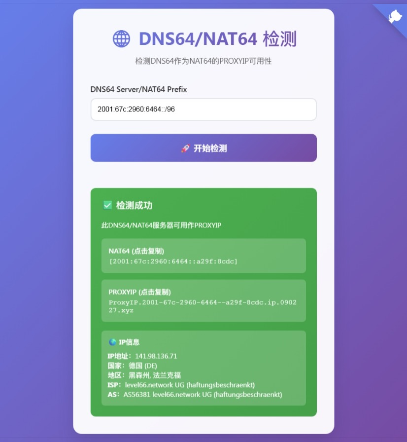

# CF-Workers-CheckNAT64

## 🌐 项目简介

CF-Workers-CheckNAT64 是一个基于 Cloudflare Workers 的工具，用于检测 DNS64/NAT64 服务器是否可以作为ProxyIP使用。

## ✨ 主要功能

- 🔍 **DNS64/NAT64 检测**：检测指定的 DNS64 或 NAT64 服务器是否可用
- 📋 **一键复制**：自动生成可用的 NAT64 地址和 PROXYIP 格式
- 🌍 **多服务器支持**：内置多个预设的 DNS64 服务器

## 🚀 部署方式

- **Workers** 部署：复制 [_worker.js](https://github.com/cmliu/CF-Workers-CheckSocks5/blob/main/_worker.js) 代码，`保存并部署`即可
- **Pages** 部署：`Fork` 后 `连接GitHub` 一键部署即可

## 🔧 使用方法

### 基本检测

1. 打开网站
2. 输入 [DNS64/NAT64](https://nat64.xyz/) 地址
3. 点击"🚀 开始检测"按钮
4. 等待检测完成，查看结果

### 检测结果

**成功时会显示：**
- ✅ 检测成功提示
- NAT64 地址（IPv6格式）
- PROXYIP 格式地址
- 点击任意结果可一键复制到剪贴板

**失败时会显示：**
- ❌ 检测失败提示
- 错误信息和原因
- NAT64 IPv6 地址（如果能解析到）

## 📋 API 接口

### 检测 NAT64

```
GET /check?nat64=2001:67c:2960:6464::/96
```

**返回示例：**
```json
{
  "success": true,
  "nat64_ipv6": "2001:67c:2960:6464:3e85:73d4::",
  "trace_data": {
    "ip": "104.16.124.96",
    "loc": "US"
  },
  "timestamp": "2024-01-01T12:00:00.000Z"
}
```

## 🌟 支持的输入格式

- **NAT64 前缀**：`2001:67c:2960:6464::/96`
- **DNS64 服务器**：`dns64.example.com`

## 💡 技术原理

1. **域名解析**：将目标域名解析为 IPv4 地址
2. **NAT64 转换**：通过 DNS64 服务器或直接计算获得 NAT64 IPv6 地址
3. **连接测试**：使用 Socket 连接到 NAT64 地址的 80 端口
4. **HTTP 请求**：发送 HTTP 请求到 `/cdn-cgi/trace` 接口
5. **结果验证**：分析返回结果判断连接是否成功

## 📄 开源协议

本项目采用 MIT 开源协议，详见 [LICENSE](LICENSE) 文件。

## 🤝 贡献指南

欢迎提交 Issue 和 Pull Request 来帮助改进项目！